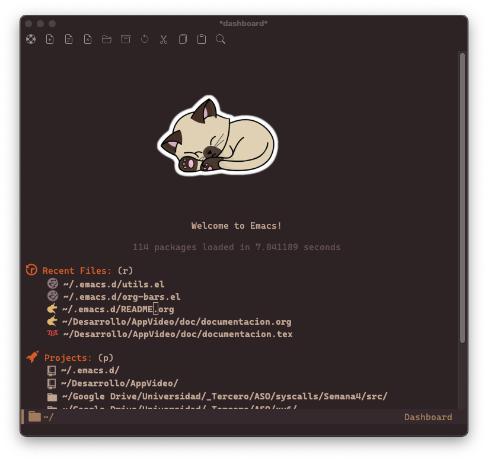
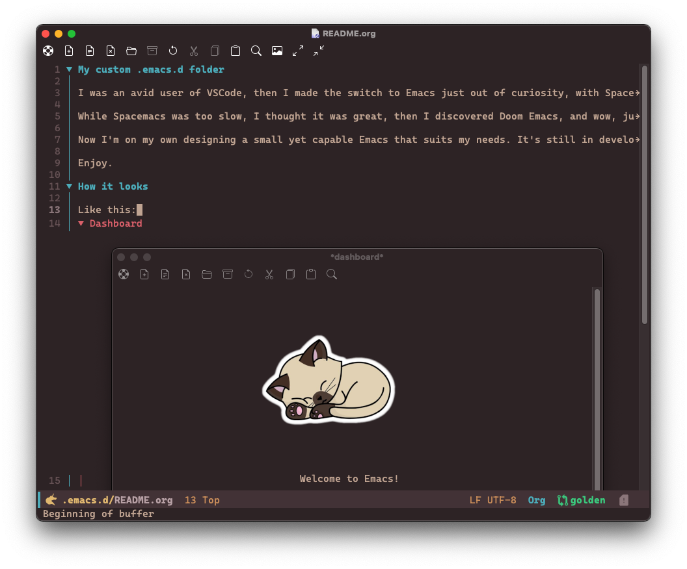
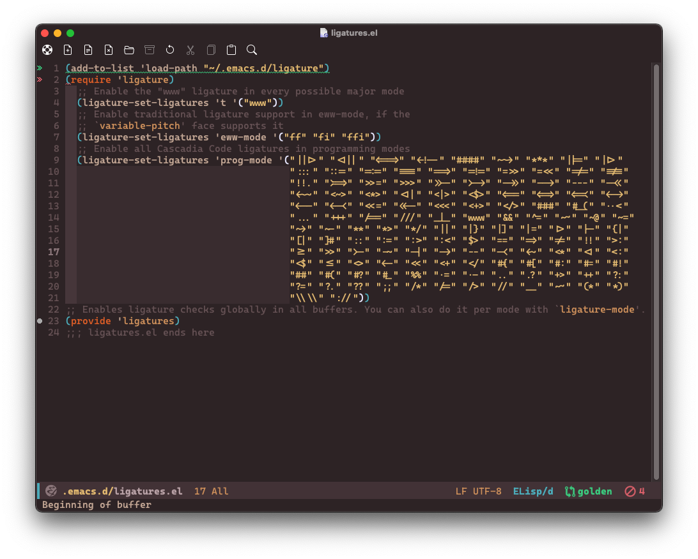
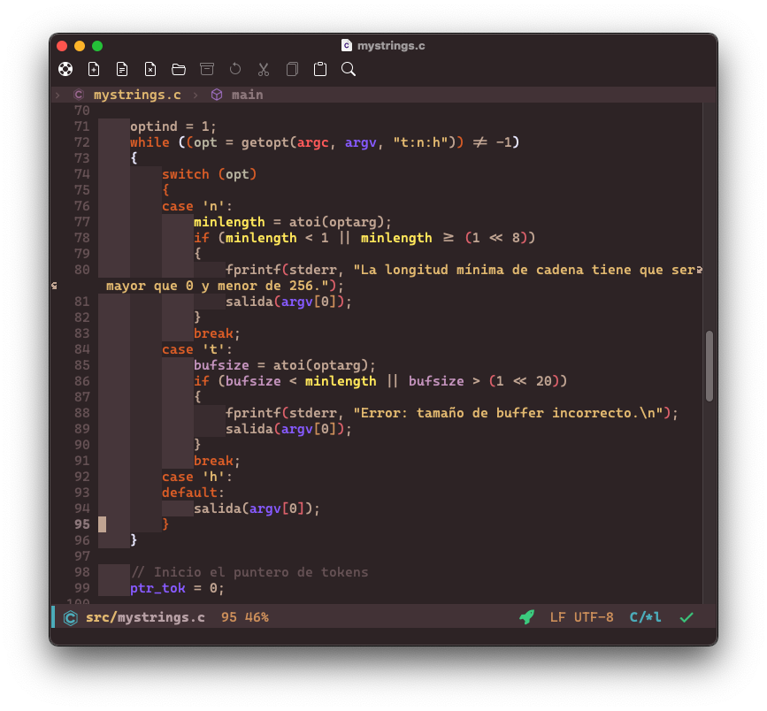

* My custom .emacs.d folder

I was an avid user of VSCode, then I made the switch to Emacs just out of curiosity, with Spacemacs.

While Spacemacs was too slow, I thought it was great, then I discovered Doom Emacs, and wow, just wow.

Now I'm on my own designing a small yet capable Emacs that suits my needs. It's still in development.

Enjoy.

* How it looks

Like this:
** Dashboard

** Editing a Org-Mode file

** It supports ligatures
But they aren't globally enabled since there's a problem with Emacs prior to v28 that may freeze the instance...

** While programming in C...

